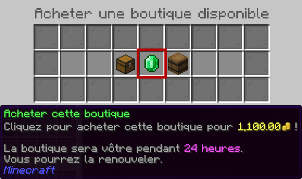
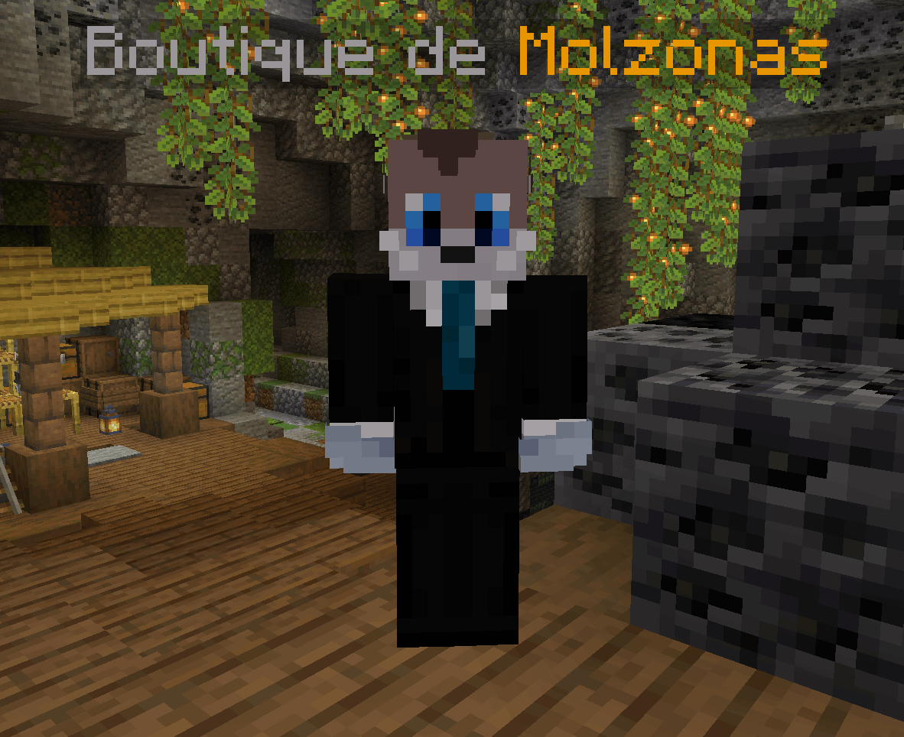
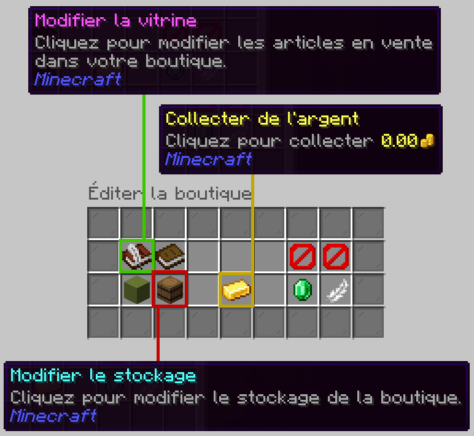
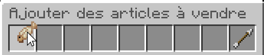
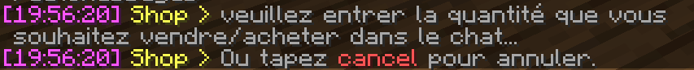
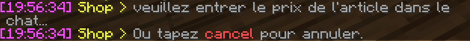
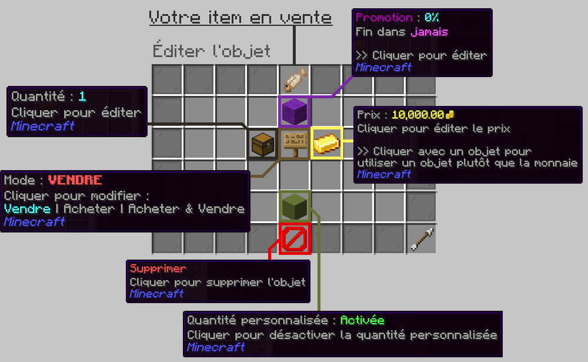
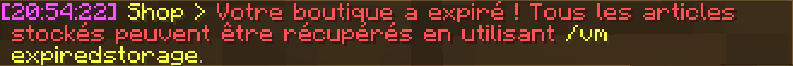

# Les boutiques joueur

Les boutiques joueur sont disponibles à l'achat ! Pour pouvoir les utiliser, n'hésitez pas à utiliser ce petit guide pratique.

## C'est quoi ?

Vous voyez le shop au spawn où vous vendez tous vos items et où vous générez votre économie ? Ce sont des **shop admins**, où vous pouvez obtenir de l'argent contre des ressources infiniment, sans joueur derrière.

Ici, on parle de **shop joueur** : vous pouvez louer un villageois et mettre à disposition des objets que vous vendez (mode vente), des objets que vous souhaitez acheter (mode achat), ou les deux (mode vente/achat). Le tout passe par une interface facile à utiliser, avec le moins de commandes possible.

## Comment louer un shop ?

Pour louer un shop, il faut trouver un villageois ayant "Boutique disponible !" d'indiqué au dessus de sa tête. Une fois trouvé, il suffit de lui cliquer dessus et d'accéder à son menu, dans lequel on peut cliquer sur l'émeraude au centre permettant de louer le shop. **Attention cependant, chaque échoppe a un prix, et chaque échoppe est une location renouvelable, ce qui signifie qu'il faut payer régulièrement au risque qu'elle ne soit plus disponible !**

Une fois achetée, un message vous indiquera que vous avez bel et bien obtenu la boutique dans le chat, et le villageois se transformera en PNJ avec votre skin, et qui se nommera "Boutique de [votre pseudo]" !

## Comment gérer mon shop (mettre en vente, mettre en stock...) ?

Pour gérer la boutique, rien de plus simple : vous devez simplement cliquer sur votre PNJ pour accéder à son menu, qui affichera 9 boutons cliquables, dont deux auxquels vous n'avez pas accès et trois qui vous seront les plus utiles.

Dans l'ordre de gauche à droite de haut en bas :
* Le livre avec plume représente la **modification de votre vitrine**, où vous pouvez mettre les objets de votre choix en vente et modifier les articles.
* Le livre sans plume représente la **visualisation de votre vitrine**, où vous pouvez observer un aperçu de votre boutique du point de vue des autres joueurs.
* Les deux icônes rouges suivantes ne sont pas disponibles aux joueurs, et servent surtout aux administrateurs en cas de soucis.
* La terracota verte représente l'**activation des notifications**, si vous souhaitez ou non recevoir des messages en cas d'achats ou de ventes dans votre boutique.
* Le baril représente votre **stock de boutique**, sous la forme d'un double coffre sur plusieurs pages remplissable.
* Le lingot d'or permet de **récupérer l'argent collecté** par votre boutique.
* L'émeraude vous permettra de **voir et d'augmenter la durée de location restante**, respectivement en passant votre souris dessus et en cliquant dessus.
* La plume permet **d'abandonner ou de vendre votre shop** si vous ne vous en servez plus ou si vous ne souhaitez plus vous en servir. Les modalités de restitution sont indiqués lorsque vous cliquez dessus.

### Mettre en vente

Pour mettre en vente un item, il suffit d'ouvrir l'interface de modification de vitrine présentée ci-dessus, et de déposer l'item ou le bloc que vous voulez mettre en vente dans l'interface.

Une fois l'item glissé/déposé, votre chat va s'ouvrir et vous demander **la quantité que vous souhaitez mettre en vente**, c'est à dire le nombre d'items achetés/vendus lors du clic.

Une fois répondu, vous aurez ensuite le choix du **prix de vente pour le lot**, c'est à dire l'argent que vous souhaitez recevoir ou donner en échange du produit.

Et voilà, votre produit est mis en vente ! Il suffit de remplir le stock de la boutique désormais pour qu'il soit disponible à l'achat aux joueurs. Si vous souhaitez configurer cela différemment, pensez à modifier le produit.

### Modifier un produit

Pour modifier un produit, il vous suffit de cliquer sur l'interface et de sélectionner le paramètre à modifier. Au survol, tout ce qui est nécessaire à savoir est expliqué.

Via cette interface, il est possible de modifier le prix du lot et la taille du lot, de choisir le mode (entre vendre le produit à d'autres joueurs, acheter le produit à d'autres joueurs, ou acheter et vendre le produit), d'appliquer une promotion pour une durée déterminée (en pourcentage de 0 à 100% du prix initial), d'activer ou désactiver le sélecteur de quantité pour les clients, et enfin de retirer le produit de la boutique.

## Arrivée à terme d'un shop

Quand votre shop arrive à expiration, vous recevrez un message immédiatement ou à votre prochaine connexion.

Il vous indique exactement comment récupérer le contenu de votre stock de boutique, via la commande `vm expiredstorage`.
L'argent à l'intérieur de la boutique n'est pas, quand à lui, forcément récupéré à la fermeture d'une boutique. Pensez donc à vérifier que votre argent a bien été récupéré avant l'expiration de votre boutique. **Toute demande de récupération d'un stock expiré ou de monnaie non récoltée sera refusée si ça n'a pas de rapports avec un bug serveur.**

## FAQ

#### Ma boutique a expirée et j'ai pas récupéré des items ou mon argent !
La réponse est littéralement au dessus.